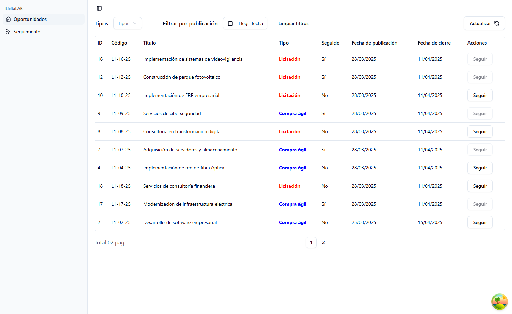

# Dashboard



### Instalación

Clona el repositorio y navega hasta el directorio:

```bash
git clone https://github.com/StefanoP21/web-licita.git
#or
git clone git@github.com:StefanoP21/web-licita.git
```

### Instala las dependencias:

```bash
npm i
#or
pnpm i
```

### Variables de Entorno

Cree un archivo .env en la carpeta raíz de su proyecto y añada sus variables. Consulte .env.template para obtener ayuda.

### Ejecución en modo de desarrollo

Para iniciar la aplicación en modo de desarrollo, ejecuta:

```bash
npm run dev
#or
pnpm run dev
```

### Ejecución en modo de producción

Para construir la aplicación para producción, ejecuta:

```bash
npm run build
#or
pnpm build
```

### Tecnologías

- [TypeScript](https://www.typescriptlang.org/)}
- [Vite](https://vite.dev/)
- [React Router](https://reactrouter.com/)
- [Redux Toolkit](https://redux-toolkit.js.org/)
- [TanStack Query](https://tanstack.com/query/latest)
- [Tailwind CSS](https://tailwindcss.com/)
- [Shadcn/ui](https://ui.shadcn.com/)

### Autor

- [Stefano Palomino](https://github.com/StefanoP21)
